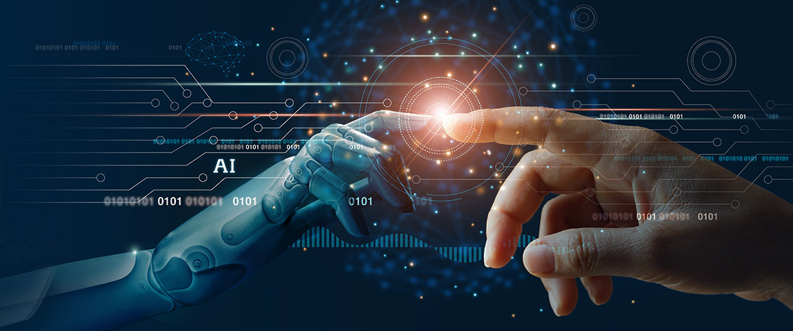

# Virtual Institute for Scientific Computing and Artificial Intelligence (VISCAI)

## High Performance Computing Workshop
### 19-20/10/2021

___________________________________________________________________________________

## Day 1

#### <a href="https://drive.google.com/file/d/1AP4a19qCyAYTyjWldyr8TZMrW6FcVxIs/view?usp=sharing" target="_blank">Day 1 Recording</a>

### 1. Introduction to High Performance Computing - Prof. Michael Backes MSc PhD 

#### <a href="https://unam164-my.sharepoint.com/:p:/g/personal/mbackes_unam_na/EVivDvPGOUhKreIYNL2IlVgBZl8DdBTFJcRZ7x3QBUM--w?e=jKIxed" target="_blank">Click here for the Slides</a>

- What is an HPC
- Uses of an HPC
- The UNAM-HPC & VISCAI

### 2. Introduction to the Linux shell - Hiiko Katjaita BSc(Hons)

#### [Click here for the Notebook](Day1/Introduction_to_Linux.ipynb)

* Why Linux?
* Connecting to the UNAM-HPC
* Introduction to Linux commands:
    * Navigating the file structure and the home directory: cd, pwd
    * File management: cp, mv, ls, cat, tail, head, touch, mkdir, rm, pipes, grep
    * Command line text editing: nano, vim
    * Introduction to environment variables

### 3. Remote file management
* File transfers: scp, sftp
* Remote file management GUI tools: WinSCP
__________________________________________________________________

## Day 2

### Recording

#### <a href="https://youtu.be/5amY6crgXNg" target="_blank">Day 2 Recording</a>

### 4. Using the HPC Cluster - Mr Jimmy Shapopi BSc(Hons) MSc

#### [Click here for the Notebook](Day2/HPC_PBS.ipynb)

* Structure of the UNAM-HPC
* The PBS job scheduler 
* Creating a PBS script
    * Naming the jobs
    * Specific resource requests
* Job scheduling and submission
* Controlling and monitoring jobs
* Outputs

### 5. Advanced Content - Mr Jimmy Shapopi BSc(Hons) MSc
* Linux shell:
    * Environment variables (.bashrc)
    * How to install programs (ask your closest admin or compile)
* Remote file management
    * rsync
* Interactively using the compute nodes.

### 6. Artificial Intelligence & Machine Learning - Dr Eli Kasai BSc BSc(Hons) MSc PhD

#### [Click here for the Slides](Day2/M.Backes-VI-SCAI_AI.PPTX)

* Introduction to ML
    * Supervised Learning
        - Regression
        - Classification
    * Unsupervised Learning
        - Dimensional Reduction
        - Clustering
    * Reinforced Learning

## [Exercises](Exercises/exe.ipynb)

